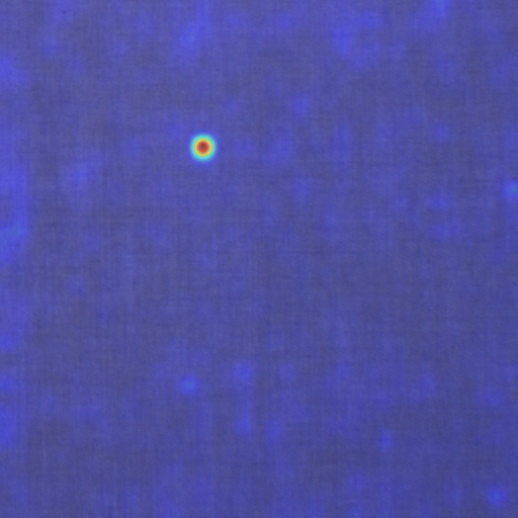
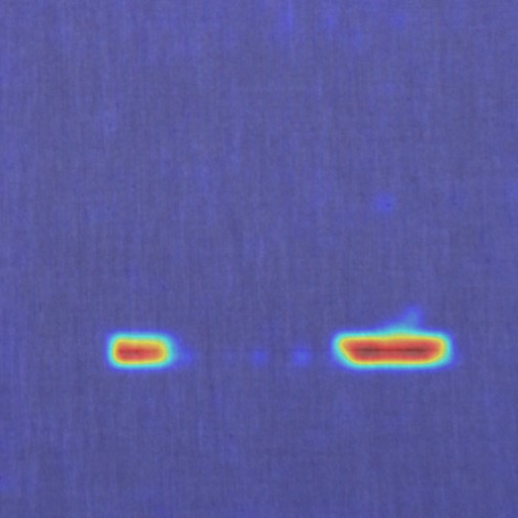
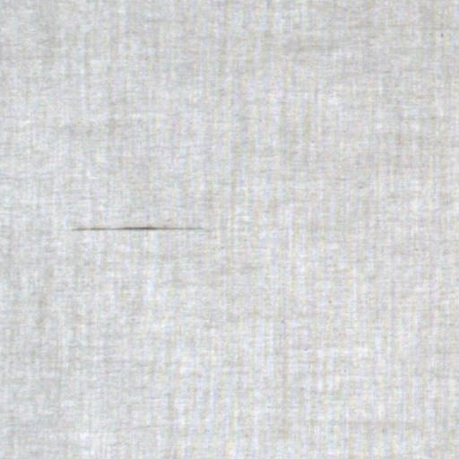
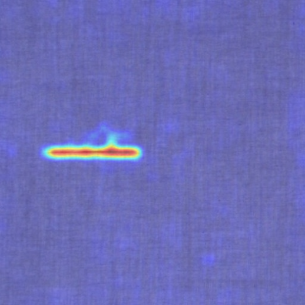
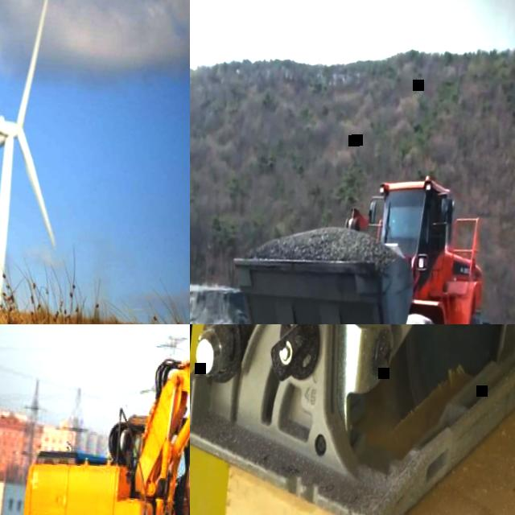
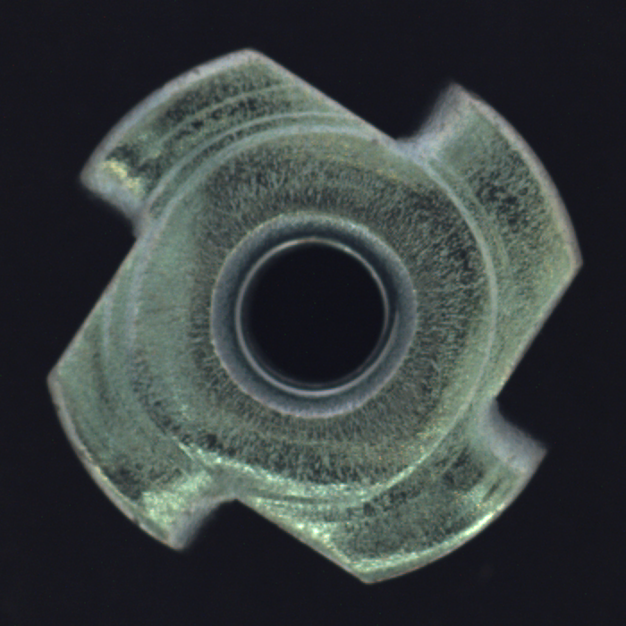

# StitchAI

> A zero-shot/few-shot vision-language inspection platform for fabric defects, worker
> safety, and machinery anomalies in Bangladesh's garment sector.

**Team HexaMind** · United International University · BCOLBD 2026 AI Category



StitchAI combines one AnomalyCLIP backbone with small category-specific reference banks.
Upload an image through the Streamlit dashboard, receive a normal/anomalous verdict and
score, inspect the heatmap, and keep the result in a unified audit log.

## At a glance

| Inspection area | What the prototype checks | Reference bank |
| --- | --- | --- |
| Fabric | Surface defects and irregular texture | `data/reference_bank/fabric/` |
| Worker safety | PPE and unsafe visual conditions | `data/reference_bank/safety/` |
| Machinery | Wear and surface anomalies | `data/reference_bank/machinery/` |

## Example output

The left image is the uploaded fabric sample. The right image is the model's anomaly
heatmap overlay; warmer colors indicate regions that contributed more strongly to the
anomaly score. This is an inspection aid for a human reviewer, not an autonomous decision.

<p align="center">
  
  
</p>

<p align="center">
  <em>Fabric input</em>&nbsp;&nbsp;&nbsp;&nbsp;&nbsp;&nbsp;&nbsp;&nbsp;&nbsp;&nbsp;
  <em>Anomaly heatmap overlay</em>
</p>

### Additional defect samples

These uploaded fabric samples contain visible surface defects detected during inspection.
Each input is shown beside its corresponding anomaly heatmap.

<p align="center">
  
  
  
  
</p>

<p align="center">
  <em>Two defects</em>&nbsp;&nbsp;&nbsp;&nbsp;&nbsp;&nbsp;
  <em>Two-defect heatmap</em>&nbsp;&nbsp;&nbsp;&nbsp;&nbsp;&nbsp;
  <em>One defect</em>&nbsp;&nbsp;&nbsp;&nbsp;&nbsp;&nbsp;
  <em>Single-defect heatmap</em>
</p>

### Other inspection categories

<p align="center">
  
  
</p>

## Status

This is an active **prototype**. The upload dashboard, FastAPI inference route, reference
banks, generated heatmaps, explanation fallback, and unified logs are wired together. The
model and thresholds still require broader validation before production use.

See `docs/01_PROJECT_OVERVIEW.md` for the full project context and `docs/03_WORKFLOW.md`
for the development workflow.

## Repository layout

```
stitchai/
├── data/            # raw datasets, few-shot reference banks, processed images
├── backbone/        # THE CORE — shared AnomalyCLIP wrapper (category-agnostic)
├── explanation/      # decoupled VLM explanation layer + cached fallbacks
├── backend/          # FastAPI app: /infer, /logs, orchestrator
├── frontend/         # Streamlit upload UI
├── storage/          # SQLite DB + InferenceLog / ReferenceImage models
├── evaluation/       # shared-approach vs. baseline comparison
├── notebooks/        # per-category exploration/eval notebooks
├── docs/             # whitepaper, diagrams, demo script
└── scripts/          # dataset download, reference bank builder, demo seeding
```

Category-specific behavior lives ONLY in `data/reference_bank/<category>/` (which normal
images you feed the model) and in `backbone/prompts.py` (which text prompts you use) —
never in separate model code per category. That separation is the whole point of the
project; keep `backbone/model_wrapper.py` category-agnostic.

## Setup

```bash
python -m venv venv
source venv/bin/activate        # Windows: venv\Scripts\activate
pip install -r requirements.txt

cp .env.example .env            # then fill in GEMINI_API_KEY etc.
```

On Windows PowerShell, activate the environment with:

```powershell
.\venv\Scripts\Activate.ps1
```

Clone the official AnomalyCLIP implementation into `backbone/anomalyclip/` (see that
folder's own README for the expected layout) — it's kept out of `requirements.txt`
since it's used as source, not an installable package.

### Run the backend

```bash
uvicorn backend.main:app --reload --port 8000
```

Check that it is ready at `http://localhost:8000/health`.

### Run the frontend

```bash
streamlit run frontend/app.py
```

Open the dashboard at `http://localhost:8501`. Start the backend before uploading an
image so the frontend can reach `/infer` and `/logs`.

## Build order

Follow the phased plan (Phase 0 → Phase 8) from the project workflow doc:

0. Setup — environment, AnomalyCLIP smoke test, hello-world backend/frontend loop.
1. Single-category proof (fabric) — the minimum viable demo.
2. Add the explanation layer + cached fallback.
3. Extend to the safety category through the *same* shared pipeline.
4. Add machinery (MVTec-AD proxy data), clearly labeled as proof-of-concept in the UI.
5. Unified audit log (`/logs`).
6. Baseline comparison & metrics table.
7. Polish, risk-proofing, demo script.
8. (Stretch) Docker, self-hosted VLM, more baselines, threshold-tuning UI.

If you have to cut scope, cut in reverse order — protect Phases 0–3 no matter what.

## Disclosed limitations (carry through to any pitch/demo)

- No training/eval data was captured on a real Bangladeshi factory floor; this is a proof
  of methodology, not a validated deployment.
- The machinery category uses MVTec-AD as a disclosed proxy — no RMG-specific machinery
  dataset exists yet. Always label this "proof of concept" in the UI.
- The system is human-in-the-loop by design and never takes autonomous action.

## License

TBD.
