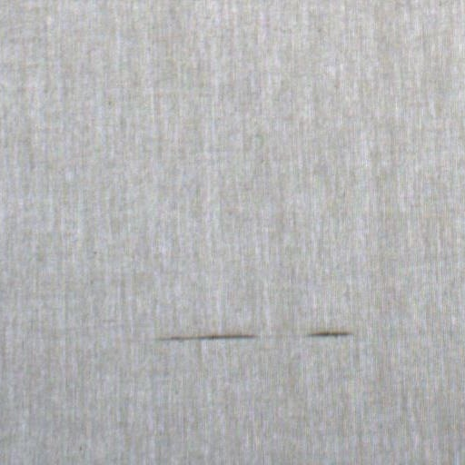
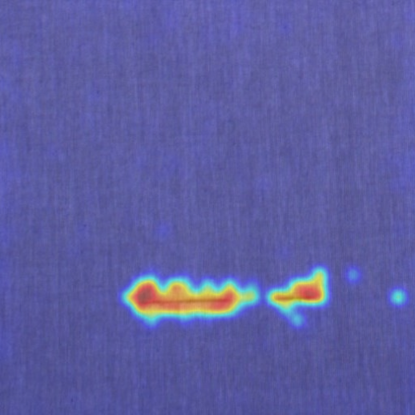
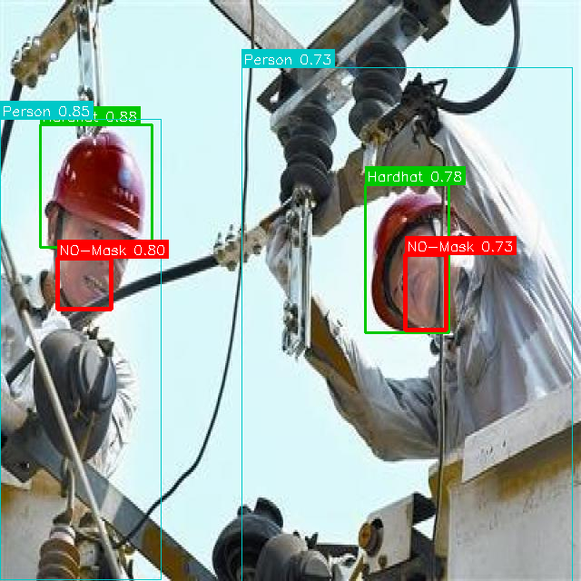
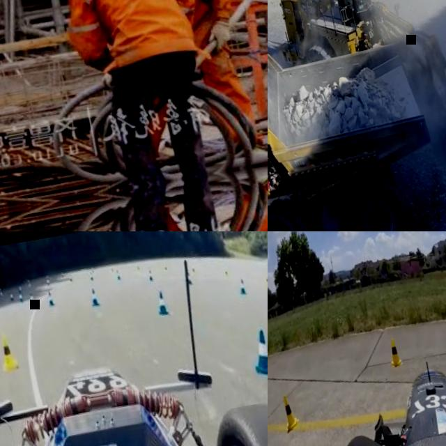
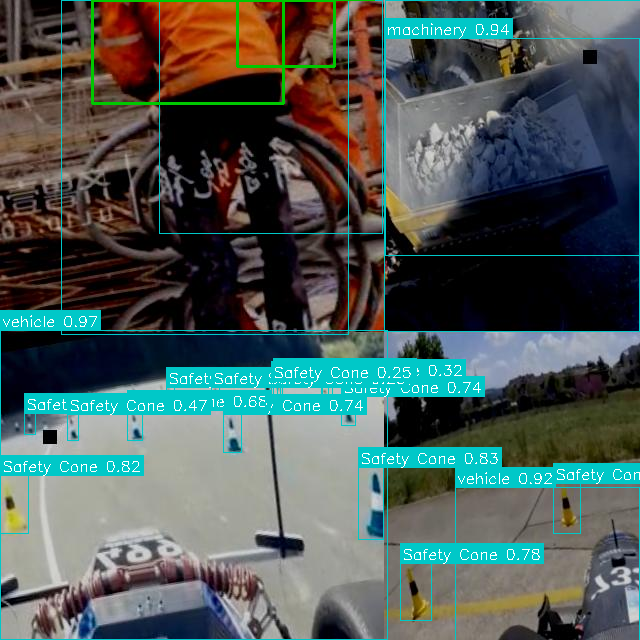
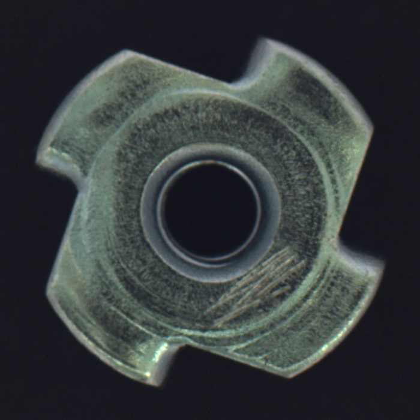
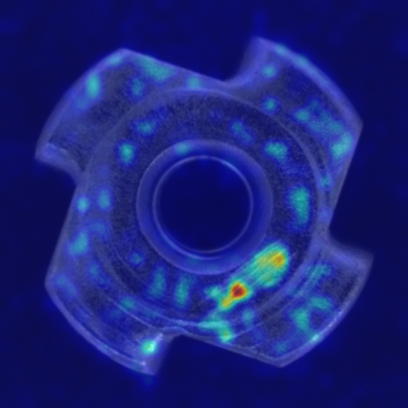
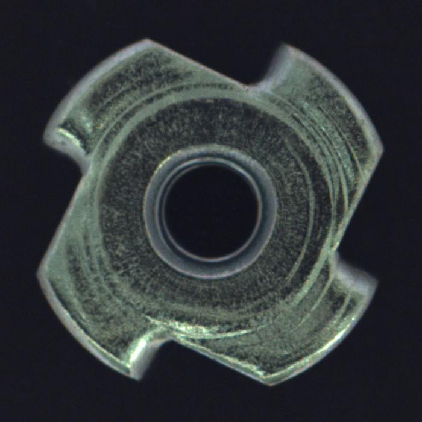
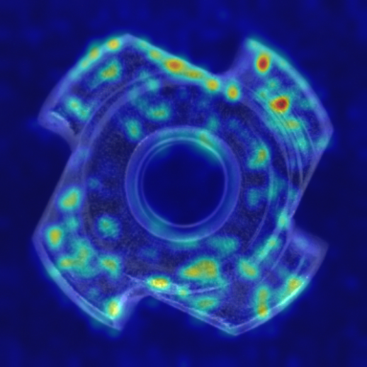

# StitchAI

> [!NOTE]
> A zero-shot/few-shot vision-language inspection platform for fabric defects, worker
> safety, and machinery anomalies in Bangladesh's garment sector.

**Team HexaMind** · United International University · BCOLBD 2026 AI Category

## Project idea

Bangladesh's ready-made garment (RMG) industry depends on consistent product quality,
safe working conditions, and reliable production equipment. A missed fabric defect can
affect an entire order, an unsafe condition can put workers at risk, and visible machine
wear can lead to downtime or costly repairs.

StitchAI is designed as one practical inspection pipeline for all three problems. A
supervisor uploads a photo of fabric, a safety condition, or machinery; the system routes
it to the right detector, returns an anomaly score, highlights suspicious regions, and
optionally explains the result in plain language. Every result — regardless of category or
detector — lands in one unified audit log. A human remains responsible for the final
decision.

## Why it matters for Bangladesh

- **Protects quality and buyer trust:** Earlier defect detection can reduce rework,
  waste, rejected batches, and delays.
- **Supports safer factories:** Visual safety checks can help teams spot recognizable
  PPE and workplace risks during routine inspections.
- **Reduces maintenance blind spots:** A visible warning sign on equipment can be logged
  and reviewed before it becomes a larger production problem.
- **Fits real data constraints:** Many factories cannot create large, labeled datasets
  for every new defect. Fabric and machinery share one AnomalyCLIP backbone plus a small
  bank of normal reference images per category, so adding a new inspection line means
  supplying new reference photos, not training a new model from scratch.

## Detection approach per category

Fabric and machinery share one AnomalyCLIP backbone. Safety uses a separate,
purpose-built detector — this was a deliberate, tested decision, not an inconsistency:
AnomalyCLIP is a texture-anomaly model, and PPE compliance is a semantic
object-presence question ("is this person wearing a hardhat") that a texture backbone
can't reliably separate. We measured this directly (compliant and violation images
scored almost identically — see `docs/PROGRESS7.md`, Phase 3) before switching. The
whitepaper's own Section 1.2 anticipated exactly this contingency: *"safety conditions
may need a lightweight task-specific visual component."*

Downstream of detection, everything is still unified: same `/infer` endpoint, same
orchestrator, same threshold → explanation → audit-log flow, same frontend. Only the
detector that produces the score differs.

| Inspection area | What the prototype checks | Detector | Reference/data |
| --- | --- | --- | --- |
| Fabric | Surface defects and irregular texture | AnomalyCLIP (shared backbone) | `data/reference_bank/fabric/` |
| Worker safety | PPE compliance (hardhat, mask, vest) | YOLOv8n (task-specific) | `data/raw/ppe_safety/` — see `backbone/safety_detector.py` |
| Machinery | Wear and surface anomalies (proof of concept) | AnomalyCLIP (shared backbone) | `data/reference_bank/machinery/` |

Upload an image through the Streamlit dashboard, receive a normal/anomalous verdict and
score, inspect the heatmap or annotated bounding boxes, and keep the result in a unified
audit log.

## Defect examples

These uploaded fabric samples contain visible surface defects detected during inspection.
Each real input is shown beside its corresponding anomaly heatmap. Warmer colors indicate
regions that contributed more strongly to the anomaly score.

### Fabric Examples

<p align="center">
  
  
</p>

<p align="center">
  
  
</p>

<p align="center">
  <em>Anomolous Fabric images & Heatmaps generated by AnomalyCLIP</em><br />
</p>

<p align="center">
  
  
</p>

<p align="center">
  <em>Normal Fabric images & Heatmaps generated by AnomalyCLIP</em><br />
</p>

### Safety Examples

<p align="center">
  
  
</p>

<p align="center">
  <em>Safety Violation images & Bounding Box generated by YOLOv8</em><br />
</p>

<p align="center">
  
  
</p>

<p align="center">
  <em>Normal Safety images & Bounding Box generated by YOLOv8</em><br />
</p>

### Machinery Examples

<p align="center">
  
  
</p>

<p align="center">
  <em>Anomolous Machinery images & Heatmaps generated by AnomalyCLIP</em><br />
</p>

<p align="center">
  
  
</p>

<p align="center">
  <em>Normal Machinery images & Heatmaps generated by AnomalyCLIP</em><br />
</p>

## Status

This is an active **prototype**. The upload dashboard, FastAPI inference route,
AnomalyCLIP backbone (fabric + machinery), the YOLOv8 safety detector, generated
heatmaps/annotations, the explanation fallback, and the unified audit log are all wired
together end to end. Two things worth knowing before treating any number as final:

- **Fabric and machinery scoring is currently zero-shot**, not few-shot. The reference
  bank images are loaded but not yet used to adjust the score (see
  `backbone/model_wrapper.py`); true few-shot calibration is a planned refinement.
- **Thresholds are data-driven from small samples** (single digits to low tens of
  images per class) — see `docs/PROGRESS7.md` for the exact numbers behind each
  category's threshold in `backbone/config.yaml`. They need revalidation on more data
  before any accuracy claim is treated as final.

See `docs/01_PROJECT_OVERVIEW.md` for the full project context and `docs/03_WORKFLOW.md`
for the development workflow.

## Repository layout

```
stitchai/
├── data/            # raw datasets, few-shot reference banks, processed images
├── backbone/        # AnomalyCLIP wrapper (fabric/machinery) + YOLOv8 safety detector
├── explanation/      # decoupled VLM explanation layer + cached fallbacks
├── backend/          # FastAPI app: /infer, /logs, orchestrator
├── frontend/         # Streamlit upload UI
├── storage/          # SQLite DB + InferenceLog / ReferenceImage models
├── evaluation/       # shared-approach vs. baseline comparison
├── notebooks/        # per-category exploration/eval notebooks
├── docs/             # whitepaper, diagrams, demo script, progress log
└── scripts/          # dataset download, reference bank builder, demo seeding
```

Fabric and machinery share `backbone/model_wrapper.py`; category-specific behavior for
those two lives only in `data/reference_bank/<category>/` and `backbone/prompts.py`,
never in separate model code. Safety is the disclosed exception: it runs through
`backbone/safety_detector.py` (YOLOv8) instead, selected by `detection_method: yolo` in
`backbone/config.yaml`. `backend/orchestrator.py` is the one place that branches on this
— every other stage (threshold, explanation, logging, frontend) treats all three
categories identically.

## Setup

```bash
git clone --recurse-submodules <this-repo-url>
cd stitchai
python -m venv venv
source venv/bin/activate        # Windows: venv\Scripts\activate
pip install -r requirements.txt
```

`backbone/anomalyclip/` is a git submodule pointing at the official AnomalyCLIP
implementation. If you cloned without `--recurse-submodules`, fetch it with:

```bash
git submodule update --init --recursive
```

You'll also need a trained AnomalyCLIP checkpoint at the path set in
`backbone/config.yaml` (`model.checkpoint_path`), and, for the safety category, a
trained YOLOv8 `best.pt` at `backbone/config.yaml`'s `categories.safety.yolo_weights_path`.

Create a `.env` file in the project root with:

```
GEMINI_API_KEY=your-key-here
```

(The explanation layer falls back to cached responses in `explanation/cached_explanations/`
if this is missing or the API call fails — detection still works either way.)

### Run the backend

```bash
uvicorn backend.main:app --reload --port 8000
```

Check that it is ready at `http://localhost:8000/health`.

### Run the frontend

```bash
streamlit run frontend/app.py
```

Open the dashboard at `http://localhost:8501`. Start the backend before uploading an
image so the frontend can reach `/infer` and `/logs`.

## Build order

Followed the phased plan (Phase 0 → Phase 8) from the project workflow doc:

0. Setup — environment, AnomalyCLIP smoke test, hello-world backend/frontend loop.
1. Single-category proof (fabric) — the minimum viable demo.
2. Add the explanation layer + cached fallback.
3. Extend to the safety category. AnomalyCLIP couldn't separate compliant/violation
   scores on this data (measured, not assumed — see `docs/PROGRESS7.md`), so safety was
   switched to a task-specific YOLOv8 detector behind the same orchestrator interface.
4. Add machinery (MVTec-AD proxy data), clearly labeled as proof-of-concept in the UI.
5. Unified audit log (`/logs`).
6. Baseline comparison & metrics table.
7. Polish, risk-proofing, demo script.
8. (Stretch) Docker, self-hosted VLM, more baselines, threshold-tuning UI.

## Disclosed limitations

- No training/eval data was captured on a real Bangladeshi factory floor; this is a proof
  of methodology, not a validated deployment.
- The machinery category uses MVTec-AD as a disclosed proxy — no RMG-specific machinery
  dataset exists yet. Always label this "proof of concept" in the UI.
- The safety category runs on a separate YOLOv8 detector, not the shared AnomalyCLIP
  backbone, because the shared backbone measurably could not separate PPE-compliant from
  non-compliant scenes. This is a disclosed, tested architectural exception — the
  orchestrator, audit log, and explanation layer stay unified around it.
- Fabric and machinery scoring is currently zero-shot; the few-shot reference-bank
  comparison described in the whitepaper is implemented as a loading mechanism but not
  yet used to adjust scores.
- Thresholds are set from small samples and need revalidation before being treated as
  production-accurate.
- The system is human-in-the-loop by design and never takes autonomous action.

## License

TBD.
